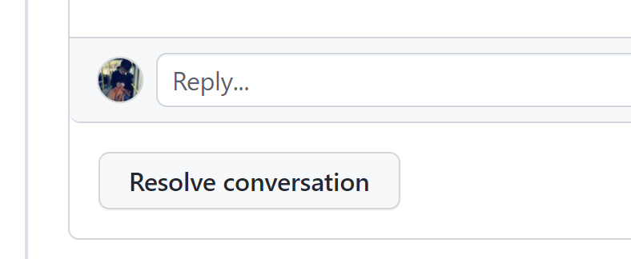

# 贡献者指南

我们欢迎一切给我们发合并请求的人，尤其欢迎：
- 长期贡献者
- 丰富注释、文档和例子的贡献者
- 新特性试用者
- 积极参与社区讨论的人

我们旗帜鲜明不欢迎这一类人：
- 不遵守本指南的人

## 设置开发环境
我们所有的开源项目都遵循同样的设置，如果你发现你在某个项目下无法按照这个流程设置好开发环境，可以给我们报 BUG。

我们假设开发环境大家使用的都是类 unix 环境，例如在 Mac 或者 Linux 上开发。如果实在 Windows 上，我们建议你使用 WSL。

- 首先，你需要安装 Go 环境，我们的要求是使用 Go 1.18，对于小版本并没有要求
- 其次安装 make 命令，我们使用很多 make 命令来辅助管理项目
- 安装 Git 环境
- 在项目下执行 make setup 命令。该命令会把 git 的钩子，项目代码质量检查等工具安装好。每次安装都会覆盖掉之前已经安装的。当你在开发过程中遇到问题，可以尝试重新执行 make setup

## 领取任务
你可以在各个项目的 issues 或者 discussion 里面找到我们正在讨论任务，进行领取。

但是领取任务之后并不代表别人就不可以完成这个任务。我们意识到，在长期的开源活动中，很多人都是一时兴起准备参与进来。在领取任务之后，突然没有时间，或者在执行的过程中遇到了问题，因此最终他很长一段时间内并没有完成这个任务。

所以在我们的项目里面，我们采取的是，谁的合并请求先通过 review，我们就用谁的。

同样地，如果你看到一个任务已经被别人领取了，但是已经过了一段时间依旧没有完成，那么你可以直接动手开发。

如果你对于如何完成一个任务有一些困惑，那么可以在对应的 issue 或者 discussion 下讨论。

## 开发过程

在开发过程中要注意的就是代码规范。在代码规范上我们整体遵循 uber 提出的规范：
- [英文版](https://github.com/uber-go/guide)
- [第三方维护中文版](https://github.com/xxjwxc/uber_go_guide_cn)

会引起性能问题、安全问题或者引入潜在 BUG 的规则，尤其需要认真对待。

> TODO 给出自己的规范。

## 提交代码

在你每次提交代码前，应该主动运行一下 make check 和 make lint，确保能够完成代码格式化和 golintci 的静态代码检查。

而后注意提交信息撰写：
- 第一行以主要修改的包为开头，整体描述你做了什么。例如在 ekit 项目里面，"slice: 支持差集和对称差集"
- 第一行之后可以跟一个列表，描述你的具体修改，例如 "- 实现 DiffSet 和 DiffSetFunc"

注意，判断提交信息是否撰写良好的标准是，后面的人能不能看懂你写了什么。

这里我们不要求一个合并请求只能有一个 commit id，我们会在最终合并的时候，将你的多个 commit id 合并为一个。

## 合并请求

要确保合并请求能够通过所有的 github action 检查，主要包括：
- deepsource：静态代码检查
- go fmt：格式化检查
- change log 检查：你需要将你的合并请求加入到每个项目的 .CHANGELOG.md 文件里面
- license 检查：大多数项目都是采用了 Apache License 2，所以每个文件都要求在最前面有一个协议，你可以从别的文件里面复制过去
- codecov：代码覆盖率检查，你需要确保你设计了足够多的测试用例
- golant-ci 检查：静态代码检查

你可以通过点击对应的 action 后面的 Details 来查看失败的具体原因，并且进行修复。

在创建了合并请求之后并不意味着你就高枕无忧，实际上你需要对这个合并请求保持关注。我们会持续 review 你的代码，并且给出修改建议。

你可以隔一段时间就打开来看一下，确认我们是否留了新的 review 意见。

如果你已经解决了我们的 review 意见，那么可以点击一下 Resolve conversation 按钮。

等我们 review 完毕，并且你已经修改完所有的 review 意见，以及 github action 都已经通过了，我们就会将你的合并请求合并进去主仓库里面。

## 其它

### issues，discussion 和 pull request 的用法

在 github 里面，我们会同时使用 issues 和 discussion。这两个东西适用于不同的场景：
- discussion：对于项目整体规划、规范类、以及还处于猜想阶段的东西会在这里讨论
- issues：步入到了具体发布任务阶段，开发以及开发过程中遇到的问题都可以在 issues 里面讨论。一些 issues 讨论整理出来的内容会被挪过去 discussion 里面，作为一个知识沉淀
- pull request：我们鼓励大家针对复杂任务可以先提交一个原型，我们会在这个原型的 pull request 里面进一步讨论细节

如果你不确定应该用什么，那么你就使用 issues，在必要的时候我们会挪过去 discussion。