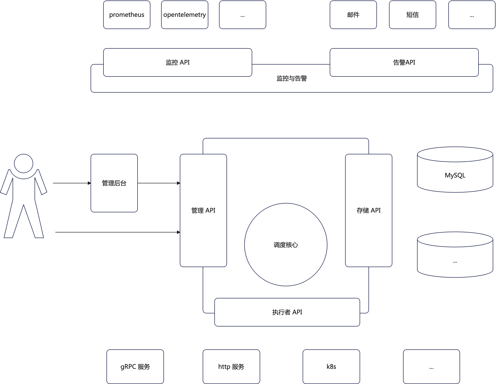

# 架构设计

## 总体设计

目前来看，整体上可以分成几个核心部分：
- 管理 API。它是用于任务自身的管理，例如创建、编辑或者修改之类的。我们会基于这个管理 API 提供一个管理后台，但是同时用户也可以构建自己的管理后台，或者直接在代码里面编程式地创建任务或者管理任务。所以这个 API 强调的是简单、通用；
- 管理后台：基于管理 API 构建的一个可视化管理后台。该管理后台能够暴露接口，以允许用户接入 SSO 和权限控制等必备模块。与此同时，该管理后台与用户自己写的管理后台应该是具有平等地位的，也就是意味着管理 API 的每一个 API 都是通用的，不能针对这个默认的管理后台做任何假设；
- 调度核心：它需要解决一下问题：
  - 广播、组播和单播调度的问题
  - 负载均衡问题
  - 重试
  - 任务编排：即在前置任务成功之后才能调用后续任务。也要考虑前置任务有必选、可选的区别；
  - 资源控制：能够控制在特性范围内的资源消耗，例如某个组，某个部门或者某个项目内部的资源消耗；
- 监控和告警：提供通用的 API，以允许用户接入各种监控。prometheus 和 opentelemetry 作为默认的实现，和用户的自定义实现地位是平等的，即 API 不能针对默认实现做任何假设。告警也是类似。本质上可以认为我们需要在整个系统里面设计一整套的埋点监控的方案；
- 执行者 API：执行者代表的是一个可以被调度的实体。我们需要考虑以下场景：
  - 任务是一个 RPC 服务：在这种情况下要考虑适配不同的 RPC 协议
  - 任务是一个 HTTP 接口：需要设计统一的 HTTP 服务定义
  - 任务是一个云原生任务，需要创建一个新的容器，运行之后就退出
- 任务存储：它一方面需要存储任务规格说明，另一方面需要存储任务调度信息。调度信息包含两个部分：即将被调度的信息，以及历史调度信息。任务存储本身是一个抽象层，我们并不局限于使用 mysql 做存储。我们需要定义出一套接入规则，允许用户提供不同的存储。同样地，我们默认提供的实现也不能具有任何的特殊的地位。在提供一个实现的时候，需要考虑以下问题：
  - 在创建的任务数量及其庞大的情况，任务该如何存储以及被快速检索

此外，出于安全性的考虑。任何涉及网络调用过程的组件之间的通信，必须设计完整的身份认证和权限控制机制。包括：
- 和管理 API 的交互
- 和执行 API 的交互

## 基本概念

### 注册任务

注册一个任务可以通过多种途径：
- 通过管理后台注册。在注册的时候需要指定任务的
  - 唯一标识符
  - 调度策略（包含负载均衡策略）
  - 前置任务
  - 可运行实例
- 通过编程接口。例如用户在自己的代码里面通过的编程的形式注册一个任务，它又分成两种形态：
  - 将自身注册为一个任务
  - 创建并且注册一个新任务，自身只是一个创建者

### 调度策略
调度策略是一个抽象，它包含：
- 重试机制：包含重试次数和退避算法，也要进一步考虑在某一次调用失败之后是否需要更换节点的问题
- 负载均衡策略：在所有可执行该任务的节点里面，选择一个合适的节点。类似地，这里也可以进一步考虑路由策略
- 广播、组播和单播：对于大多数任务来说，只需要在一个候选节点上运行。但是对于对实时性或者可用性要求比较高的任务来说，它们会希望在所有的节点上运行。还有一些任务，可能只能运行在特定的一些候选节点上

### 候选节点
可执行某个任务的节点，被称为该任务的候选节点。候选节点可以通过以下几个方式执行（或者发现）：
- 引入类似服务发现机制，根据任务的唯一标识符来查找候选节点
- 直接指定：用户在注册任务的时候直接指定候选节点的域名或者 IP + 端口
- 创建容器运行：这一类任务并没有候选节点，而是调度核心根据任务的配置实时创建容器，在执行完毕之后，回收资源

### 任务编排

任务之间存在一定的依赖关系。调度核心在调度任务的时候，需要检查该任务的所有前置条件是否满足，满足之后才能被调度。类似地，当一个任务结束之后，要考虑调度后置任务。

### 远程插件
所有的任务，都允许在调度的周期内注册一些远程插件。这些插件和调度核心将通过 gRPC 或者 http 协议进行通信。

举个例子来说，在执行负载均衡筛选节点的时候，如果用户希望动态筛选节点，那么可以调用用户注册的负载均衡策略插件。调度核心根据返回的结果进行调度

### 任务规格说明

或者说，任务配置。任务的编排、调度都是通过任务规格说明来配置的。本质上，任务的注册就是一个生成任务规格说明的过程。

因此调度核心重要职责就是解释这一份任务规格说明。