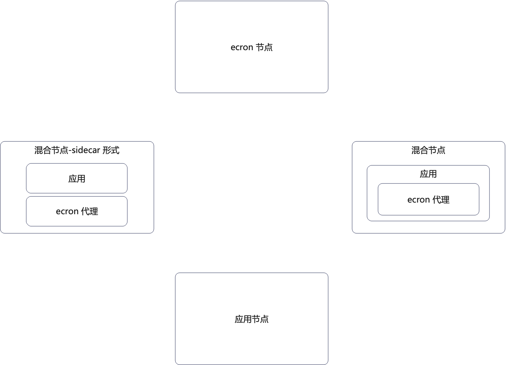
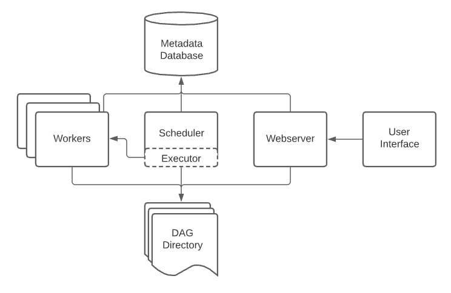

# 行业方案

如果你对我们是从什么方面调研的，可以参考这个：
- [2022.12.15 会议纪要](https://github.com/gotomicro/ecron/discussions/1)

这里总结如下，更加详细的分析可以看后面（持续更新）的章节。

## 总结

### 集群模式
从这些中间件的形态上来说，我们比较认可的是两种设计：
- 一种是主从模式，但是主节点只负责分片，而从节点负责实际的调度工作。从节点是否需要具备分片信息是一个值得讨论的地方；
- 一种是对等结构，每一个节点负责从一个中心的存储里面去抢夺任务，抢到了就负责调度执行。但是这里也有一个问题是值得讨论，即这些节点之间要不要建立起联系。理论上来说这些节点并不需要互相感知；

目前来看，主从模式并不具备决定性的优势，但是主节点的可预测性更强。即我们可以通过主节点来知晓系统发生的一切。

另外，如果我们打算提供复杂的管理接口，例如对任务的增删改查，尤其是注册新任务的接口，那么在高并发之下，主从模式的主节点会成为性能瓶颈。

而对等模式的难处则在于，当用户对任务进行增删改查的时候，该由哪个节点来处理请求。

集群模式应该是第一重要的问题，它直接决定了整个系统的形态。

### 调度节点和执行节点
在一些中间件里面，并没有区分调度节点和执行节点。我们要在逻辑上区分这些节点，但是实际部署的时候，一个节点可以同时是调度节点和执行节点。

之所以一定要引入调度节点，是因为在我们准备支撑非常大并发的场景下，需要很多节点来执行任务的调度（并不是执行任务，单纯的调度）。包括：
- 启动任务
- 收集任务运行信息
- 重试
- 超时控制
- ...

我们可以预期：
- 对于小规模用户来说，他可以直接用自己的应用节点来作为调度节点和执行节点；
- 对于大规模用户来说，他可以独立部署纯粹的调度节点、执行节点；

大多数时候，应用节点应该就是一个执行节点。那么所谓的调度任务执行，就是调度节点发一个 HTTP 调用或者 gRPC 调用。

如果调度节点和执行节点是通过网络来进行通信的，那么就会引入一个新的问题：调度节点如何确定执行节点的执行情况。举一个最简单的例子，调度节点至少应该和执行节点保持心跳（在执行过程）。

调度节点可以考虑轮询执行节点的执行情况，也可以考虑让执行节点上报自己的执行情况。

执行节点的发现（即找到某个特定的任务可以在哪些节点上执行）基本和服务发现的过程基本一致，也可以考虑通过配置IP，配置域名，注册中心等方式进行。

### 修改任务信息
修改任务信息基本上都分成两个步骤：
- 修改存储的任务信息
- 调度节点订阅任务信息变更

首先毫无疑问这中间是存在一定程度的延时的。那么在这个延时期间，可能被修改的任务就用老的配置执行了一次。不过用户必须容忍这种延时，我们也应该意识到，延时总是存在的，只不过是长短的问题。

### 可观测性
可观测性，也就是任务执行日志（并不是任务执行情况），较为常见的方案是任务执行者上报调度者（如果存在一个对应的调度者的话）。在这种情况下，系统的瓶颈则在于对应的调度者，必须有足够的能力处理这些日志。而对于任务执行者来说，它也必须要有足够的能力来及时发送这些日志。

这两个条件在高并发的场景之下都很难得到满足。这个难题基本等价于如何设计一个高性能的日志采集器和日志中心。

因此我们并不一定非得设计这种形态的东西。我们可以考虑抽象出来一个抽象的日志输出和上报的接口。那么对于小规模的用户来说，他们并不需要上报到调度器——这样可以节省资源，而是仅仅写入到本地。另一方面，一些有需要的用户也可以考虑利用 logstash 之类的组件来采集本地日志，而后进行汇总。

### 存储设计

考虑到这些已有的组件并不都是使用数据库来存储任务配置、任务调度信息、任务执行信息，所以我们肯定要抽象出来一个引擎。在我们的目标里面，这个存储可以由以下来实现：
- 关系型数据库
- 远程配置中心
- Redis 等 kev-value 存储结构
- 文档数据库
- ...

进一步，我们可以发现，这些存储的数据我们可以分成两部分，一部分是用于驱动整个系统持续运行的，一类是的审计信息，主要是用来排查问题的。那么我们要考虑显式分离这两类信息，并且最好是能做到用户可以针对两部分采用不同的实现。

这里面有一个含糊的地方，就是所谓的可观测性里面的日志，和这里的审计信息。理论上来说，它们应该是同一个东西。因此可以考虑利用日志组件来完成审计信息的记录。不同的是，日志不需要支持复杂查询，但是审计信息一般需要支持类似于根据任务 ID 来查找之类的场景。好在当下的互联网里面已经有足够多的东西帮助我们完成日志检索，例如 ES等。

### 任务状态变更订阅

几乎可以预料到的是，用户肯定有需要订阅任务状态的需求。在这方面同样的抽象出来一个通知的机制。而这个机制可以借助于第三方中间件的订阅机制，又或者直接借助于 Go 本身的 channel 都可以。可以预期的是，我们可以尝试提供以下几种途径的订阅机制：
- HTTP、gRPC 或者 websocket 查询接口
- MQ
- Redis 等订阅机制
- ZK 之类的（包含 nacos, etcd）订阅机制
- 关系型数据库的 CDC 接口，例如 MySQL binlog 机制

任务状态变更订阅应该清晰说明当前任务的状态，具体包含什么内容可以在实践中根据需要逐步添加。

## xxl-job
xxl-job 调研由 [@KirinRyuuri](https://github.com/KirinRyuuri)完成，[原文](https://github.com/gotomicro/ecron/discussions/4)

### 主从模式
xxl-job 依旧采用的是主从模式，在这种形态下，主节点会负责调度任务，而从节点只是负责任务的执行。

### 固定间隔和固定速度任务

在 xxl-job 里面严格区分了两种任务：
- 固定速度任务：例如每隔三十分钟执行一次，那么三十分钟计数是从任务启动的时候开始的。意味着不管这一次任务执行时长，以及究竟有没有执行完毕，三十分钟一到，又会触发新一次任务；
- 固定间隔任务：例如每隔三十分钟执行一次，那么三十分钟计数是从任务完成之后开始的，作为对比，固定速度是从任务开始的时候计时的

这也就给了用户充分的选择权。不过这两种设计都要进一步考虑容错的问题，比如说固定任务速度，如果要是上一次任务都还没完结，这一次启动的时候要不要强制杀掉上一次的任务。而固定间隔任务则是要考虑，如果上一次任务都已经执行了好几天，要不要强制杀掉，以触发下一次任务。

### 任务状态监听

xxl-job 的任务状态监听有一个很有意思的设计，即我们可以通过设置子任务的形式来达成"任务完成之后进行通知"的目标。但是这种设计不适合整个状态流程变更，因为每一次状态变迁，都要注册一个新的子任务，这对系统来说引入了不必要的负载。

当然单纯从设计上来说，这是一种非常优雅的无侵入式设计。

### 可观测性

日志是执行节点主动上报调度中心的。这种形态总台来看不是一种好的设计，因为它存在一个无法解决的弊端，即如果上报失败了，或者没有来得及上报，那么就会丢失这部分数据。

更好的策略应该是执行节点自己记录日志，而后使用日志组件采集不同执行节点的日志，最后进行汇总。

### 待确定的点
- 主从选举

## ElasticJob 

ElasticJob 调研由[@yzicheng](https://github.com/yzicheng)完成，[原文](https://gitee.com/yzcgitte/elasticjob/blob/master/ElasticJob.md)

### ElasticJob-Lite

Elastic-Job-Lite 是去中心化的，以 Jar 包提供的轻量级分布式任务协调服务。这种形态有很多好处：
- 用户不需要额外部署服务器，对于中小企业，或者小规模应用来说，是一个极大的成本优势
- 应用本身就可以作为任务调度、任务执行的实例，也是节省成本
- 从开发的角度来说，用户注册一个任务，就和写一个普通的接口差不多

我们可以考虑借鉴这一种思路。也就是说整个任务调度集群，就是应用集群，不再需要额外的集群。又或者说，用户可以自己选择是否采用独立的 ecron 集群，也可以混用。所谓混用就是一些实例就是只部署了 ecron，而另外一些实例就是任务本身和 ecron 的代理部署在一起。

进一步说，这种形态可以衍生为，在用户的应用实例里面部署一个 sidecar，或者将任务调度本身嵌进去一个已有的 sidecar 里面。

如图所示，其中 ecron 节点，混合节点和混合-sidecar 节点将会参与任务调度，或者主从选举和任务分片之类的事情。

但是任务执行，或者任务本身，ecron 节点就不能参与了，因为它是纯粹的 ecron 节点，上面没有任何的任务逻辑。

更加巧妙地是，我们可以通过加入一个中心节点，比如说 etcd 之类的，来转化成主从结构。那么主节点就只负责分片，从节点负责调度。这种形态就接近 ElasticJob 本身的形态了。可以考虑给予不同的权重来控制调度的负载。例如说对于纯粹的 ecron 节点，权重很高，混合节点权重比较低——应用越是复杂的，权重越低。

### 主从模式
ElasticJob 的主从模式有一个特征，即主节点只负责分片之类的事情，或者说确定某个任务应该在哪个节点上调度。而所有的从节点都可以看做是对等节点。

如果主节点不存在，则是阻塞式地选举出来一个主节点。主节点会把分片信息同步过去从节点，所以从节点实质上知道当前集群的分片信息。那么在某一个从节点成为主节点之后，它就可以选择完全重新分片，还是仅仅重新分片一部分。从设计的角度来说，应该要尽可能的减少重新分片。

这种模式的设计很优秀。它兼具主从模式和对等模式的优点。但是主从切换的时候会面临一些问题。（需要进一步考察主从切换的过程）

这种设计要比纯粹的对等结构，即每一个节点都允许执行分片要简单，而且没有一致性的问题。

### 任务状态监听

用户可以通过订阅 ZK 的事件来得知任务的执行情况。

我们可以尝试采用类似的手段，即我们可以同时暴露 http 接口，websocket 接口，MQ，以及类似于这种配置中心的接口，允许用户订阅任何有关任务状态变更的事件。相比之下，它这个局限于 ZK 稍微欠缺一点抽象。

### 可观测性
分成了执行日志和追踪日志。
这种分离在大规模集群高并发下会很有效果，但是如果并发度不高，或者任务数量整体不多的时候，就稍微有点不必要了。

### 需要确定的点
- Elastic-Job-Lite 是怎么选举的，以及 Elastic-Job-Lite 是怎么发现节点的，用户要配置好，还是通过广播来查找？
- Mesos - Framework 的主要功能、架构设计和核心接口设计
- ElasticJob 和 zookeeper 打交道，是直接操作 zookeeper 还是说抽象出来了一层接口。例如说，如果抽取出来了接口，那么我能不能提供其它实现，比如说基于 etcd 的实现？
- 主从切换的时候，如果待提升的从节点上还有任务，那么会怎么处理？
- 主从模式下，是不是只能通过主节点来增删改任务，查询能否经过从节点？
- 确认表结构设计是否有分库分表或者分区之类的支持

## Kubernetes

k8s 的调研部分由 [@henrysworld](https://github.com/henrysworld) 完成，[原文](https://henrysworld.github.io/2022/12/26/kubernetes-scheduler%20/)

### 分析

k8s 整体设计自然是十分优秀的，其中值得我们重点关注和学习的点：
- 声明式设计
- Job 和 CronJob 的分离

#### 声明式设计

这算是 k8s 一贯以来的设计风格。在我们架构设计里面也是打算借鉴这这种设计思路。即所有的任务都会有一份任务规格说明，而所谓的调度引擎就是根据这份规格说明来执行调度。所以总体上来说，我们的设计可以称为配置驱动，或者 spec driven。

#### Job 和 CronJob 分离
理论上来说，在 k8s 里面的 Job 概念，应该只能算是 CronJob 的一种特殊形态。

我们可以设想，假如说我们有一个定时任务是每天 00:30:00 执行一次。那么所谓的一次性任务就是只执行一次的定时任务；而实时任务则是只执行一次的，恰好立刻执行的定时任务。

所以从设计上来说，Job 和 CronJob 的区分是无所谓的，完全可以将它们纳入统一抽象之下。而两个参数 completions 和 parallelism CronJob 一样可以使用。completions 也就是我们调度策略里面谈及的应该在多少个实例上调度，而 parallelism 则可以理解为该任务允许并行调度多少个实例。

> 猜想是因为 k8s 本身不是一个纯粹的任务调度框架，所以受制于其他诸如容器编排的功能，而不得不引入这种区分

#### 任务信息存储

令人惊讶的是，k8s 的所有配置，不管是 Job 还是 CronJob，都是利用 etcd 来存储的。我们可以考虑将 etcd 作为存储引擎的一种实现。因此 k8s 如何在 etcd 上组织自己的 Job 和 CronJob 的配置，就很值得关注。

### 待确认的点
- k8s 的队列是如何设计的：
  - k8s 什么情况下会往里面加入任务？例如说，我有一个每日 00:30:00 执行的任务，这个任务是每天（例如 00:15:00）加入一次，然后执行完，还是使用了什么其它策略？比如说，每天执行一次这一类的任务，k8s 总不可能一次性生成从 2023 年到 2123 年的所有调度信息
  - 在删除或者修改任务的情况下，k8s 怎么快速定位到队列中相关的任务？注意 k8s 是采用遍历，还是接近 map 之类的数据结构 
  - 队列的容量，即它最多允许放置多少个任务？
  - 队列是否有分组之类的机制？例如说，近一分钟内就要被调度的任务在一个组里面；近半小时的在另外一个组里。又或者说整个 k8s 集群只有一个队列，还是说逻辑上只有一个队列，但是内部有很多子队列？
- k8s 的时间精度问题。例如说我们预期在 00:30:00 执行，那么它可能在什么精度的时间范围内调度到这个任务？例如说秒级精度就是会在 00:29:59 - 00:30:01 这个时间段内调度到
- k8s 的任务编排能否解决前置任务这种场景？
- k8s 的容错机制：
  - 任务运行时间过长会如何？
  - 任务失败了，怎么重试？重试一直失败会如何？
  - 如果一个任务占据了很多资源，会不会影响别的任务调度？
  - 如果一个任务是半小时运行一次，但是某一次运行超过了半小时，会造成时间窗口重叠吗？即这个时候会同时有两个同样的任务运行吗？又或者说，当我们说半个小时运行一次的时候，半小时是从上一次任务结束之后开始计时，还是从上一次任务开始运行的时候就开始计时？
- k8s 队列相关的 API（只需要接口）：从队列中增删改查任务的接口，重中之重是调度器怎么从队列里面拿到任务
- Job 和 CronJob 的完整配置：即所有允许用户配置的配置项，以及它们的含义。

## Airflow
Airflow 调研由 [@YogiLiu](https://github.com/YogiLiu) 完成，[原文](https://gist.github.com/YogiLiu/0183138a1eb68d7a61245382cbda2414)

### 分析

#### DAG
Airflow 也是使用 DAG（有向无环图）来描述任务之间的依赖。例如：

#### Scheduler 和 Executor

在 Airflow 里面，Scheduler 用于调度任务执行，Executor 是 Airflow 内部代表执行的结构体。真正执行任务的实际上是 Worker，可以认为 Executor 是 Worker 在系统内部的代表。

### 待确认的点
- Airflow 是如何描述 DAG 的。或者说用户该怎么配置，以及 Airflow 是否存在
- Airflow 是如何判断某个任务的前置任务全部已经完成了，也就是可以调度该任务了
- Scheduler 的轮询机制：
  - 要注意，这种轮询机制在任务量非常大的情况下，是否会出现问题
- meta database 表结构设计

## crocodile

crododile 调研由[@hoysics](https://github.com/hoysics) 完成，[原文](https://www.yuque.com/u32041491/xtft7p/xff0vc1i4hu2ogsi)

### 集群模式
对等集群。采用的是所有的调度节点争抢分布式锁的方案，谁拿到了锁，那么就是谁来调度。这种设计需要使用一个能作为分布式锁的东西，一般就是 Redis。

这种设计应该算是没什么出彩的地方，在很多跟调度相关的场景里面都能见到类似的设计。

优点则是整体架构、设计和实现都非常简单，包括稳定性、鲁棒性都很强。

### 前端辅助 cron 表达式
对于很多新人来说，写出准确无误的 cron 表达式是一件很难的事情。所以我们最好有一些额外的手段能够减轻我们用户的心智负担。一种可行的方案就是在管理页面，用户注册任务的时候可以提供可视化的编写 cron 表达式的手段。

### 可观测性

crocodile 的可观测性和 xxl-job 的设计接近，都是执行节点上报给调度中心。那么问题依旧是可能存在日志丢失的可能，以及在大规模分布式任务调度的情况下，调度中心可能撑不住上传日志的 QPS。

### 任务运行信息

在这里，crocodile 要求任务返回一个状态码，而后 crocodile 和预期的状态码进行比较，来确定一个任务究竟有没有执行成功。这种策略很接近 k8s 的形态。

这就和另外一种设计冲突。这种比较简单的设计是预先定义任务的几个状态，例如 INIT, RUNNING, DONE 和 FAILED 四个状态。那么如果任务正常结束的话，就应该返回 DONE 这个状态。

而更加灵活的设计是用户自己自定义任务的状态，并且决定任务什么时候可以运行，什么时候算是失败，以及什么时候算是成功。

### 任务发现
在 crocodile 里面引入了一个新的机制，也就是主机组的概念。我们可以认为，crocodile 允许用户手动分组，而后将任务绑定到某个主机组里面。

这接近于微服务框架里面的任务调度过程中的路由，或者说分组功能。

这算是一个很值得学习的特点。

### 待确认的点
- 如果上传日志失败，有什么容错手段？以及调度中心怎么保护自己不会被上报日志压垮？
- 如何设定主机组？里面的 IP 是怎么指定的？需要提前配置所有的 IP 吗？还是依赖于类似于服务发现机制，来发现 IP，而后进行分组？

## Temporal
Temporal 调用由[BreezeHubs](https://github.com/BreezeHubs)完成，[原文](https://github.com/BreezeHubs/temporal)。

### 任务编排
Temporal 里面引入了两个概念
- workflow 
- activity

activity 接近我们说的任务，而 workflow 可以理解有前置后置关系的一组任务。在 Temporal 里面是不允许单独调度 activity 的，而是只能调度 workflow 整体。

这个命名应该是借鉴了工作流引擎的命名。不过 workflow 和 activity 也揭示了如果我们想要设计具备任务编排功能的框架，那么在我们的框架里面也需要有类似的概念。

但是我们认为强制限定 workflow 为唯一可以调度的实体并不太合适。我们认为应该可以在 workflow 和 activity 都独立调度。但是 activity 之间有依赖关系，那么单独调度 activity 必须限定在一个特定的上下文内，也就是在某一个 workflow 内。

在状态上，workflow 自身就维持住了一个状态机。唯一比较有特色的状态是 Continued-As-New，意味着 workflow 结束之后立刻开启下一个 workflow。

### 待确定的点
- 如果 workflow 中的某一个步骤失败了，可以从该特定的步骤重启吗？还是必须从头开始？

## celery

celery 调研由[@Stone-afk](https://github.com/Stone-afk)完成，[原文](https://github.com/Stone-afk/celery_research_documents)。

### 调度模型

celery 的调度模型看起来不太像是分布式任务调度系统。它分成调度器和工作进程，调度器本身也是一个进程。从 celery 的设计上来看，它并没有支持跨网络的调用。

### signature

signature 在 celery 里面应该算是一个很神奇的东西，它虽然很灵活，但是在 Go 语言里面怕是设计不出来这种东西。除非我们考虑设计自己的任务定义语言，或者说任务调度语言，然后自己编写解释器，不然怕是难以设计类似的东西。

### 命令行工具
celery 提供了命令行工具用于查看任务运行的情况。这是值得学习的，例如说我们可以考虑提供一个客户端代理，这个代理接收命令行命令，或者 http 调用，而后返回任务运行的信息。或者返回该节点上和 ecron 相关的任何信息。

### 回调机制

和其他框架不一样，celery 并没有直接暴露状态的接口，而是提供了回调机制。整体上来说这是一个抽象层次稍微低一点的抽象。因为我们完全可以提供订阅状态变更的接口，而后二次封装这个接口，伪装成一个回调接口，允许用户注册不同的回调。

celery 整体上来说是一个语言强相关的框架，所以不出意料 celery 的回调都是一段代码。而如果在分布式环境下设计和语言没有关系的回调，那么就需要将回调抽象为诸如 HTTP 接口，gRPC 接口等与具体语言无关的形态。

### 待确认的点
- celery 是否支持跨网络调用，例如 A 机器上的调度器，调度 B 机器上的工作进程
